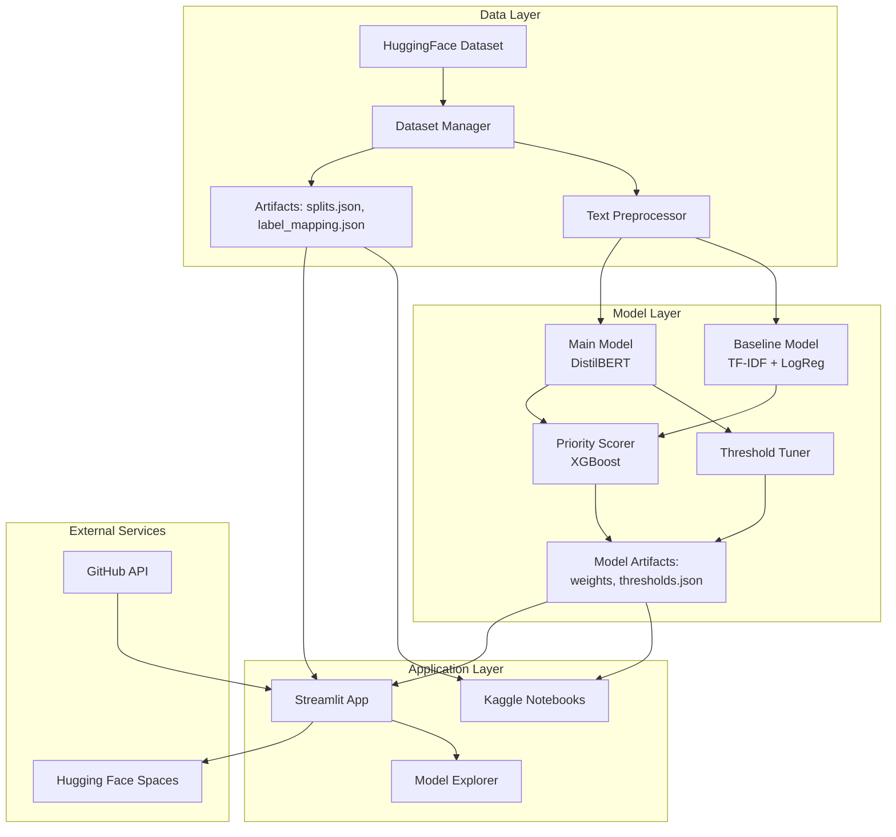
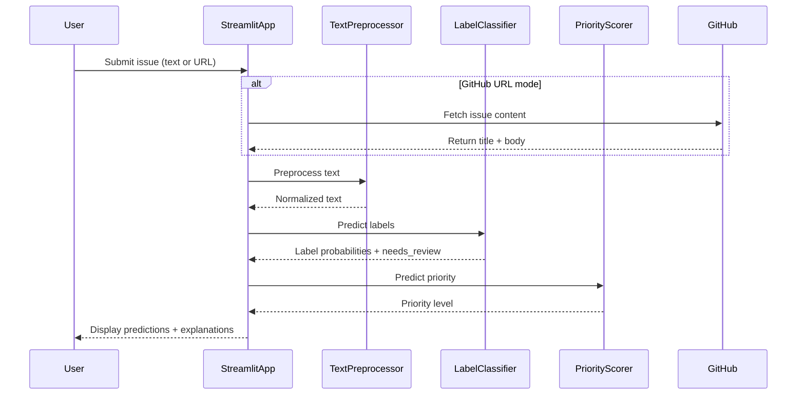

# Design Document: GitHub Issue Auto-Labeler

## Overview

The GitHub Issue Auto-Labeler is a multi-component machine learning system that automatically classifies GitHub issues into canonical labels and assigns priority scores. The system consists of three main pipelines:

1. **Data Pipeline**: Handles dataset loading, splitting, preprocessing, and artifact management
2. **Model Pipeline**: Implements baseline and main classification models with threshold optimization
3. **Application Pipeline**: Provides user interfaces through Kaggle notebooks and a Streamlit web application

The architecture follows a modular design where each component has clear responsibilities and interfaces, enabling independent development and testing. The system prioritizes reproducibility through versioned artifacts (splits.json, label_mapping.json, thresholds.json) and uses TensorFlow/Keras as the primary deep learning framework.

## Architecture

### High-Level Architecture



### Component Interaction Flow



## Components and Interfaces

### 1. Dataset Manager

**Responsibility**: Load, split, and manage the GitHub issues dataset with reproducible artifacts.

**Interface**:
```python
class DatasetManager:
    def load_dataset() -> Dataset:
        """Load lewtun/github-issues from HuggingFace"""
        
    def create_splits(dataset: Dataset, seed: int = 42) -> Dict[str, Dataset]:
        """Create 80/10/10 train/val/test splits"""
        
    def save_splits(splits: Dict[str, List[int]], path: str = "splits.json"):
        """Save split indices to JSON file"""
        
    def load_splits(path: str = "splits.json") -> Dict[str, List[int]]:
        """Load split indices from JSON file"""
        
    def create_label_mapping() -> Dict[str, int]:
        """Create canonical label mapping"""
        
    def save_label_mapping(mapping: Dict[str, int], path: str = "label_mapping.json"):
        """Save label mapping to JSON file"""
        
    def load_label_mapping(path: str = "label_mapping.json") -> Dict[str, int]:
        """Load label mapping from JSON file"""
```

**Dependencies**: HuggingFace datasets library

**Artifacts Produced**:
- `splits.json`: Contains train/val/test indices
- `label_mapping.json`: Maps canonical labels to integer indices

### 2. Text Preprocessor

**Responsibility**: Clean and normalize GitHub issue text for model input.

**Interface**:
```python
class TextPreprocessor:
    def preprocess(text: str) -> str:
        """Apply all preprocessing steps"""
        
    def remove_markdown(text: str) -> str:
        """Remove markdown formatting syntax"""
        
    def normalize_code_blocks(text: str) -> str:
        """Extract and normalize code blocks"""
        
    def normalize_stack_traces(text: str) -> str:
        """Normalize stack trace formatting"""
        
    def replace_urls(text: str, token: str = "[URL]") -> str:
        """Replace URLs with standardized token"""
```

**Dependencies**: re (regex), potentially TextBlob for advanced text processing

**Processing Pipeline**:
1. Remove markdown syntax (**, __, ##, etc.)
2. Extract code blocks (```...```) and normalize
3. Detect and normalize stack traces
4. Replace URLs with [URL] token
5. Normalize whitespace

### 3. Baseline Model

**Responsibility**: Provide TF-IDF + Logistic Regression baseline for performance comparison.

**Interface**:
```python
class BaselineModel:
    def __init__(self, max_features: int = 10000):
        """Initialize TF-IDF vectorizer and LogReg classifier"""
        
    def fit(X_train: List[str], y_train: np.ndarray):
        """Train on preprocessed text and multi-label targets"""
        
    def predict_proba(X: List[str]) -> np.ndarray:
        """Return probability scores for all 7 labels"""
        
    def save(path: str):
        """Save vectorizer and classifier"""
        
    def load(path: str):
        """Load vectorizer and classifier"""
```

**Dependencies**: scikit-learn (TfidfVectorizer, LogisticRegression, MultiOutputClassifier)

**Configuration**:
- TF-IDF: max_features=10000, ngram_range=(1,2)
- LogReg: C=1.0, max_iter=1000, class_weight='balanced'

### 4. Main Model (DistilBERT)

**Responsibility**: Fine-tuned transformer model for high-quality multi-label classification.

**Interface**:
```python
class DistilBERTClassifier:
    def __init__(self, num_labels: int = 7, model_name: str = "distilbert-base-uncased"):
        """Initialize DistilBERT with classification head"""
        
    def compile_model(learning_rate: float = 2e-5):
        """Compile with optimizer and loss function"""
        
    def fit(X_train: List[str], y_train: np.ndarray, 
            X_val: List[str], y_val: np.ndarray,
            epochs: int = 3, batch_size: int = 16):
        """Fine-tune on training data with validation"""
        
    def predict_proba(X: List[str]) -> np.ndarray:
        """Return probability scores for all 7 labels"""
        
    def save(path: str):
        """Save model weights"""
        
    def load(path: str):
        """Load model weights"""
```

**Dependencies**: TensorFlow/Keras, transformers (HuggingFace)

**Architecture**:
- Base: DistilBERT (distilbert-base-uncased)
- Classification head: Dense(768 -> 7) with sigmoid activation
- Loss: Binary cross-entropy (multi-label)
- Optimizer: Adam with learning rate 2e-5

**Training Configuration**:
- Epochs: 3-5
- Batch size: 16
- Max sequence length: 512 tokens
- Early stopping on validation loss

### 5. Threshold Tuner

**Responsibility**: Optimize per-label classification thresholds on validation set.

**Interface**:
```python
class ThresholdTuner:
    def optimize_thresholds(y_true: np.ndarray, y_pred_proba: np.ndarray,
                           metric: str = "f1") -> Dict[str, float]:
        """Find optimal threshold for each label independently"""
        
    def save_thresholds(thresholds: Dict[str, float], path: str = "thresholds.json"):
        """Save thresholds to JSON file"""
        
    def load_thresholds(path: str = "thresholds.json") -> Dict[str, float]:
        """Load thresholds from JSON file"""
        
    def apply_thresholds(y_pred_proba: np.ndarray, 
                        thresholds: Dict[str, float]) -> np.ndarray:
        """Apply per-label thresholds to probabilities"""
```

**Dependencies**: scikit-learn (metrics), numpy

**Optimization Strategy**:
- For each label independently:
  - Try thresholds from 0.1 to 0.9 in steps of 0.05
  - Calculate F1 score for each threshold
  - Select threshold that maximizes F1 score
- Save optimal thresholds to thresholds.json

**Artifacts Produced**:
- `thresholds.json`: Maps each label to its optimal threshold

### 6. Priority Scorer

**Responsibility**: Predict issue priority (LOW/MEDIUM/HIGH) using XGBoost.

**Interface**:
```python
class PriorityScorer:
    def __init__(self):
        """Initialize XGBoost classifier"""
        
    def generate_pseudo_labels(labels: np.ndarray, 
                               label_names: List[str]) -> np.ndarray:
        """Generate priority pseudo-labels from deterministic rules"""
        
    def fit(X_train: np.ndarray, y_train: np.ndarray):
        """Train on label predictions and pseudo-label priorities"""
        
    def predict(X: np.ndarray) -> np.ndarray:
        """Predict priority level (0=LOW, 1=MEDIUM, 2=HIGH)"""
        
    def predict_proba(X: np.ndarray) -> np.ndarray:
        """Return probability scores for each priority level"""
        
    def save(path: str):
        """Save XGBoost model"""
        
    def load(path: str):
        """Load XGBoost model"""
```

**Dependencies**: xgboost, numpy

**Pseudo-Label Rules**:
```python
def generate_pseudo_labels(labels: np.ndarray, label_names: List[str]) -> np.ndarray:
    # labels: binary matrix (n_samples, 7)
    # label_names: ['bug', 'feature', 'documentation', 'performance', 
    #               'question', 'good-first-issue', 'security']
    
    priorities = []
    for label_vector in labels:
        label_dict = dict(zip(label_names, label_vector))
        
        if label_dict['security'] == 1:
            priority = 2  # HIGH
        elif label_dict['bug'] == 1 and label_dict['performance'] == 1:
            priority = 2  # HIGH
        elif label_dict['good-first-issue'] == 1:
            priority = 0  # LOW
        elif label_dict['question'] == 1:
            priority = 0  # LOW
        elif label_dict['bug'] == 1 or label_dict['performance'] == 1:
            priority = 1  # MEDIUM
        elif label_dict['feature'] == 1:
            priority = 1  # MEDIUM
        else:
            priority = 0  # LOW (default)
            
    return np.array(priorities)
```

**Features**: 7-dimensional binary vector of predicted labels

**XGBoost Configuration**:
- max_depth: 5
- learning_rate: 0.1
- n_estimators: 100
- objective: multi:softmax (3 classes)

### 7. Label Classifier (Orchestrator)

**Responsibility**: Orchestrate preprocessing, classification, threshold application, and needs-review flagging.

**Interface**:
```python
class LabelClassifier:
    def __init__(self, model: Union[BaselineModel, DistilBERTClassifier],
                 preprocessor: TextPreprocessor,
                 thresholds: Dict[str, float]):
        """Initialize with model, preprocessor, and thresholds"""
        
    def predict(text: str) -> Dict:
        """
        Returns:
        {
            'labels': List[str],  # Labels exceeding threshold
            'probabilities': Dict[str, float],  # All label probabilities
            'needs_review': bool,  # True if no label exceeds threshold
            'label_vector': np.ndarray  # Binary vector for priority scorer
        }
        """
```

**Dependencies**: TextPreprocessor, model (Baseline or DistilBERT), thresholds.json

**Prediction Flow**:
1. Preprocess input text
2. Get probability scores from model
3. Apply per-label thresholds
4. Determine needs_review flag (True if all probs < thresholds)
5. Return predictions with metadata

### 8. Streamlit Application

**Responsibility**: Provide web interface for issue classification and model exploration.

**Structure**:
```
streamlit_app/
├── app.py                 # Main entry point
├── pages/
│   ├── 1_Text_Paste.py   # Direct text input mode
│   ├── 2_GitHub_URL.py   # GitHub URL fetch mode
│   └── 3_Model_Explorer.py  # Model analysis and explanations
├── utils/
│   ├── github_fetcher.py  # GitHub API integration
│   ├── model_loader.py    # Load models and artifacts
│   └── explainer.py       # SHAP-based explanations
└── requirements.txt
```

**Page 1: Text Paste Mode**
- Text area for issue title + body
- Submit button
- Display: predicted labels, probabilities, priority, needs_review flag
- Display: SHAP explanation highlighting influential words

**Page 2: GitHub URL Mode**
- Text input for GitHub issue URL (e.g., https://github.com/owner/repo/issues/123)
- Fetch button
- Display fetched issue content
- Display: same predictions as Text Paste mode
- Error handling for invalid URLs or API failures

**Page 3: Model Explorer**
- Model comparison table (Baseline vs DistilBERT metrics)
- Per-label performance visualization (Plotly bar charts)
- Threshold visualization (show optimal thresholds per label)
- Priority scorer feature importance (SHAP summary plot)
- Confusion matrix for priority predictions

**Dependencies**: streamlit, requests (GitHub API), plotly, shap

### 9. GitHub Fetcher

**Responsibility**: Retrieve issue content from GitHub URLs.

**Interface**:
```python
class GitHubFetcher:
    def parse_url(url: str) -> Tuple[str, str, int]:
        """Extract owner, repo, issue_number from URL"""
        
    def fetch_issue(owner: str, repo: str, issue_number: int) -> Dict:
        """
        Fetch issue from GitHub API
        Returns: {'title': str, 'body': str, 'labels': List[str]}
        """
        
    def fetch_from_url(url: str) -> Dict:
        """Convenience method combining parse and fetch"""
```

**Dependencies**: requests

**API Endpoint**: `https://api.github.com/repos/{owner}/{repo}/issues/{issue_number}`

**Error Handling**:
- Invalid URL format → return error message
- API rate limit exceeded → return error with retry suggestion
- Issue not found (404) → return error message
- Network errors → return error with retry suggestion

### 10. Model Explainer

**Responsibility**: Generate SHAP-based explanations for model predictions.

**Interface**:
```python
class ModelExplainer:
    def __init__(self, model: Union[BaselineModel, DistilBERTClassifier],
                 preprocessor: TextPreprocessor):
        """Initialize with model and preprocessor"""
        
    def explain_prediction(text: str, label: str) -> Dict:
        """
        Generate SHAP explanation for specific label
        Returns: {
            'shap_values': np.ndarray,
            'tokens': List[str],
            'base_value': float
        }
        """
        
    def visualize_explanation(text: str, label: str) -> plotly.Figure:
        """Create Plotly visualization of SHAP values"""
```

**Dependencies**: shap, plotly

**Implementation Notes**:
- For Baseline (TF-IDF): Use SHAP's LinearExplainer
- For DistilBERT: Use SHAP's PartitionExplainer or sampling-based approach
- Highlight top 10 most influential tokens per label

## Data Models

### Dataset Schema

**Input Data** (from lewtun/github-issues):
```python
{
    'title': str,           # Issue title
    'body': str,            # Issue body/description
    'labels': List[str],    # Original GitHub labels
    'state': str,           # 'open' or 'closed'
    'created_at': str,      # ISO timestamp
    'repo': str             # Repository name
}
```

**Processed Data**:
```python
{
    'text': str,                    # Concatenated title + body (preprocessed)
    'canonical_labels': np.ndarray, # Binary vector (7,) for multi-label
    'priority': int,                # 0=LOW, 1=MEDIUM, 2=HIGH
    'split': str                    # 'train', 'val', or 'test'
}
```

### Artifact Schemas

**splits.json**:
```json
{
    "train": [0, 1, 2, ...],
    "val": [1000, 1001, ...],
    "test": [2000, 2001, ...],
    "seed": 42
}
```

**label_mapping.json**:
```json
{
    "bug": 0,
    "feature": 1,
    "documentation": 2,
    "performance": 3,
    "question": 4,
    "good-first-issue": 5,
    "security": 6
}
```

**thresholds.json**:
```json
{
    "bug": 0.45,
    "feature": 0.50,
    "documentation": 0.55,
    "performance": 0.40,
    "question": 0.60,
    "good-first-issue": 0.35,
    "security": 0.30
}
```

### Model Output Schema

**Label Classifier Output**:
```python
{
    'labels': ['bug', 'performance'],           # Labels exceeding threshold
    'probabilities': {                          # All label probabilities
        'bug': 0.87,
        'feature': 0.23,
        'documentation': 0.12,
        'performance': 0.65,
        'question': 0.08,
        'good-first-issue': 0.15,
        'security': 0.05
    },
    'needs_review': False,                      # No label exceeded threshold
    'label_vector': np.array([1, 0, 0, 1, 0, 0, 0])  # Binary vector
}
```

**Priority Scorer Output**:
```python
{
    'priority': 'HIGH',                         # Predicted priority level
    'priority_probabilities': {                 # Probability distribution
        'LOW': 0.10,
        'MEDIUM': 0.25,
        'HIGH': 0.65
    }
}
```

### Performance Metrics Schema

```python
{
    'model_name': str,                          # 'baseline' or 'distilbert'
    'micro_f1': float,                          # ≥ 0.75 target
    'macro_f1': float,                          # ≥ 0.65 target
    'hamming_loss': float,                      # ≤ 0.15 target
    'per_label_f1': {                           # Per-label F1 scores
        'bug': float,                           # ≥ 0.50 target
        'feature': float,                       # ≥ 0.50 target
        'documentation': float,                 # ≥ 0.50 target
        'performance': float,                   # ≥ 0.50 target
        'question': float,                      # ≥ 0.50 target
        'good-first-issue': float,              # ≥ 0.50 target
        'security': float                       # ≥ 0.35 target
    },
    'inference_time_cpu': float,                # < 3.0 seconds target
    'confusion_matrix': np.ndarray              # For priority scorer
}
```


## Correctness Properties

*A property is a characteristic or behavior that should hold true across all valid executions of a system—essentially, a formal statement about what the system should do. Properties serve as the bridge between human-readable specifications and machine-verifiable correctness guarantees.*

### Property 1: Dataset Split Ratios

*For any* dataset with sufficient size (n ≥ 100), when creating train/val/test splits with the Dataset_Manager, the resulting split sizes should be approximately 80%/10%/10% of the total dataset size (within ±2% tolerance).

**Validates: Requirements 1.2**

### Property 2: Split Serialization Round-Trip

*For any* valid split indices dictionary, serializing to JSON then deserializing should produce an equivalent dictionary with the same train/val/test indices.

**Validates: Requirements 1.3**

### Property 3: Label Mapping Serialization Round-Trip

*For any* valid label mapping dictionary, serializing to JSON then deserializing should produce an equivalent mapping with the same label-to-index associations.

**Validates: Requirements 1.5**

### Property 4: Text Preprocessing Completeness

*For any* issue text containing markdown syntax, code blocks, stack traces, or URLs, the Text_Preprocessor should remove/normalize all such elements, producing clean text without markdown formatting, with code blocks normalized, stack traces normalized, and URLs replaced with [URL] tokens.

**Validates: Requirements 2.1, 2.2, 2.3, 2.4**

### Property 5: Preprocessing Idempotence

*For any* valid issue text, applying preprocessing twice should produce the same result as applying it once (preprocessing is idempotent).

**Validates: Requirements 2.6**

### Property 6: Model Output Dimensionality

*For any* input text, both the Baseline_Model and Main_Model should return probability scores as a 7-dimensional vector, with one probability for each canonical label.

**Validates: Requirements 3.4, 4.4**

### Property 7: Multi-Label Classification Support

*For any* input text, both the Baseline_Model and Main_Model should be capable of predicting multiple labels simultaneously, where each label probability is computed independently (sum of probabilities may exceed 1.0).

**Validates: Requirements 3.5, 4.5**

### Property 8: Model Weight Serialization Round-Trip

*For any* trained Main_Model, saving the model weights then loading them should produce a model that generates equivalent predictions (within numerical precision tolerance of 1e-6) for the same inputs.

**Validates: Requirements 4.6**

### Property 9: Inference Latency Constraint

*For any* input text with length ≤ 512 tokens, the Label_Classifier should complete prediction within 3 seconds when running on CPU.

**Validates: Requirements 5.6**

### Property 10: Threshold Serialization Round-Trip

*For any* valid thresholds dictionary, serializing to JSON then deserializing should produce an equivalent dictionary with the same per-label threshold values.

**Validates: Requirements 6.3**

### Property 11: Threshold Application

*For any* prediction with label probabilities and per-label thresholds, the Label_Classifier should only include labels in the output where the probability exceeds the corresponding threshold.

**Validates: Requirements 6.5**

### Property 12: Needs Review Flag Logic

*For any* prediction, the Needs_Review_Flag should be true if and only if no label probability exceeds its corresponding threshold, and false otherwise.

**Validates: Requirements 7.2, 7.3**

### Property 13: Priority Level Output Validity

*For any* input label vector, the Priority_Scorer should predict exactly one of three valid priority levels: LOW (0), MEDIUM (1), or HIGH (2).

**Validates: Requirements 8.2**

### Property 14: Pseudo-Label Generation Rules

*For any* label vector, the pseudo-label generation function should correctly apply all deterministic rules: security → HIGH, bug+performance → HIGH, good-first-issue → LOW, question → LOW, with appropriate defaults for other combinations.

**Validates: Requirements 8.3, 8.4, 8.5, 8.6, 8.7**

### Property 15: GitHub URL Parsing

*For any* valid GitHub issue URL in the format `https://github.com/{owner}/{repo}/issues/{number}`, the GitHubFetcher should correctly extract the owner, repository name, and issue number.

**Validates: Requirements 11.1**

### Property 16: Issue Content Concatenation

*For any* fetched GitHub issue with title and body, the System should concatenate them (with appropriate spacing) to create the input text for classification.

**Validates: Requirements 11.4**

## Error Handling

### Data Pipeline Errors

**Dataset Loading Failures**:
- **Error**: HuggingFace dataset unavailable or network failure
- **Handling**: Retry with exponential backoff (3 attempts), then fail with clear error message
- **User Action**: Check network connection, verify dataset name

**Invalid Split Configuration**:
- **Error**: Dataset too small for 80/10/10 split (n < 30)
- **Handling**: Raise ValueError with minimum dataset size requirement
- **User Action**: Use larger dataset or adjust split ratios

**Artifact Loading Failures**:
- **Error**: splits.json, label_mapping.json, or thresholds.json missing or corrupted
- **Handling**: Raise FileNotFoundError with path and regeneration instructions
- **User Action**: Regenerate artifacts by running data preparation notebook

### Preprocessing Errors

**Empty or Null Input**:
- **Error**: Empty string or None provided to Text_Preprocessor
- **Handling**: Return empty string (graceful degradation)
- **User Action**: Provide valid issue text

**Encoding Errors**:
- **Error**: Non-UTF-8 characters in input text
- **Handling**: Replace invalid characters with Unicode replacement character (�)
- **User Action**: None (handled automatically)

**Extremely Long Text**:
- **Error**: Input text exceeds 10,000 characters
- **Handling**: Truncate to first 10,000 characters with warning log
- **User Action**: None (handled automatically, may affect accuracy)

### Model Errors

**Model Loading Failures**:
- **Error**: Model weights file missing or corrupted
- **Handling**: Raise FileNotFoundError with model path and retraining instructions
- **User Action**: Retrain model or download pre-trained weights

**Out of Memory**:
- **Error**: Insufficient memory for model inference (especially DistilBERT)
- **Handling**: Catch OOM exception, suggest reducing batch size or using CPU
- **User Action**: Reduce batch size, close other applications, or use smaller model

**Invalid Model Input**:
- **Error**: Input shape mismatch or invalid data type
- **Handling**: Raise ValueError with expected input format
- **User Action**: Verify preprocessing pipeline is applied correctly

**Threshold Application Errors**:
- **Error**: Threshold value out of range [0, 1]
- **Handling**: Clip threshold to valid range with warning log
- **User Action**: Verify thresholds.json is not manually edited incorrectly

### Priority Scorer Errors

**Invalid Label Vector**:
- **Error**: Label vector is not 7-dimensional or contains non-binary values
- **Handling**: Raise ValueError with expected format
- **User Action**: Verify label classifier output format

**XGBoost Model Errors**:
- **Error**: XGBoost model file missing or version mismatch
- **Handling**: Raise FileNotFoundError with retraining instructions
- **User Action**: Retrain priority scorer with current XGBoost version

### GitHub API Errors

**Invalid URL Format**:
- **Error**: URL doesn't match GitHub issue pattern
- **Handling**: Return error dict: `{'error': 'Invalid GitHub URL format', 'expected': 'https://github.com/owner/repo/issues/123'}`
- **User Action**: Provide valid GitHub issue URL

**API Rate Limit Exceeded**:
- **Error**: GitHub API returns 403 with rate limit message
- **Handling**: Return error dict with retry-after time: `{'error': 'Rate limit exceeded', 'retry_after': '2024-01-01T12:00:00Z'}`
- **User Action**: Wait until rate limit resets or provide GitHub token for higher limits

**Issue Not Found**:
- **Error**: GitHub API returns 404
- **Handling**: Return error dict: `{'error': 'Issue not found', 'url': provided_url}`
- **User Action**: Verify issue number and repository name

**Network Errors**:
- **Error**: Connection timeout or network unreachable
- **Handling**: Retry once, then return error dict: `{'error': 'Network error', 'message': exception_message}`
- **User Action**: Check network connection and retry

### Streamlit Application Errors

**Model Initialization Failures**:
- **Error**: Models fail to load on app startup
- **Handling**: Display error page with diagnostic information and setup instructions
- **User Action**: Verify all model artifacts are present in deployment

**Prediction Timeout**:
- **Error**: Prediction takes longer than 10 seconds (watchdog timeout)
- **Handling**: Cancel prediction, display timeout message, suggest shorter input
- **User Action**: Reduce input text length or try again

**SHAP Explanation Failures**:
- **Error**: SHAP explainer fails to generate explanations
- **Handling**: Log error, display predictions without explanations, show warning message
- **User Action**: None (predictions still available)

### Error Logging Strategy

All errors should be logged with:
- Timestamp
- Error type and message
- Stack trace (for unexpected errors)
- Input context (sanitized, no PII)
- Component name

Log levels:
- **ERROR**: Failures that prevent operation completion
- **WARNING**: Degraded functionality but operation continues
- **INFO**: Normal operational messages (model loaded, prediction completed)

## Testing Strategy

### Dual Testing Approach

The system will employ both unit testing and property-based testing to ensure comprehensive coverage:

**Unit Tests**: Focus on specific examples, edge cases, and error conditions. These tests validate concrete scenarios and integration points between components.

**Property Tests**: Verify universal properties across all inputs using randomized test data. These tests ensure correctness holds for the entire input space, not just hand-picked examples.

Both testing approaches are complementary and necessary. Unit tests catch concrete bugs and validate specific behaviors, while property tests verify general correctness and uncover edge cases that might not be considered in manual test case design.

### Property-Based Testing Configuration

**Framework**: Use `hypothesis` library for Python property-based testing

**Test Configuration**:
- Minimum 100 iterations per property test (due to randomization)
- Each property test must reference its design document property
- Tag format: `# Feature: github-issue-auto-labeler, Property {number}: {property_text}`

**Example Property Test Structure**:
```python
from hypothesis import given, strategies as st
import hypothesis

@given(st.text(min_size=10, max_size=1000))
@hypothesis.settings(max_examples=100)
def test_preprocessing_idempotence(text):
    """
    Feature: github-issue-auto-labeler, Property 5: Preprocessing Idempotence
    For any valid issue text, applying preprocessing twice should produce 
    the same result as applying it once.
    """
    preprocessor = TextPreprocessor()
    once = preprocessor.preprocess(text)
    twice = preprocessor.preprocess(once)
    assert once == twice
```

### Unit Testing Strategy

**Framework**: pytest for Python unit tests

**Coverage Targets**:
- Minimum 80% code coverage for core components
- 100% coverage for critical paths (prediction pipeline, pseudo-label generation)

**Test Organization**:
```
tests/
├── unit/
│   ├── test_dataset_manager.py
│   ├── test_text_preprocessor.py
│   ├── test_baseline_model.py
│   ├── test_distilbert_model.py
│   ├── test_threshold_tuner.py
│   ├── test_priority_scorer.py
│   ├── test_label_classifier.py
│   └── test_github_fetcher.py
├── property/
│   ├── test_properties_data.py
│   ├── test_properties_preprocessing.py
│   ├── test_properties_models.py
│   └── test_properties_priority.py
├── integration/
│   ├── test_end_to_end_pipeline.py
│   └── test_streamlit_app.py
└── fixtures/
    ├── sample_issues.json
    ├── test_splits.json
    └── test_thresholds.json
```

### Component-Specific Testing

**Dataset Manager**:
- Unit: Test split creation with known dataset sizes
- Unit: Test artifact serialization/deserialization
- Property: Verify split ratios for random dataset sizes (Property 1)
- Property: Verify serialization round-trips (Properties 2, 3)

**Text Preprocessor**:
- Unit: Test markdown removal with specific examples
- Unit: Test code block extraction with various formats
- Unit: Test URL replacement with different URL patterns
- Unit: Test stack trace normalization
- Property: Verify all preprocessing operations complete (Property 4)
- Property: Verify idempotence (Property 5)
- Edge case: Empty input, very long input, special characters

**Baseline Model**:
- Unit: Test model initialization with correct components
- Unit: Test training with small dataset
- Unit: Test prediction output format
- Property: Verify 7-dimensional output (Property 6)
- Property: Verify multi-label capability (Property 7)

**Main Model (DistilBERT)**:
- Unit: Test model architecture initialization
- Unit: Test TensorFlow/Keras implementation
- Unit: Test tokenization and input preparation
- Property: Verify 7-dimensional output (Property 6)
- Property: Verify multi-label capability (Property 7)
- Property: Verify weight serialization round-trip (Property 8)
- Property: Verify inference latency (Property 9)

**Threshold Tuner**:
- Unit: Test threshold optimization with known probabilities
- Unit: Test threshold application with edge cases (all above, all below)
- Property: Verify serialization round-trip (Property 10)
- Property: Verify threshold application logic (Property 11)

**Label Classifier**:
- Unit: Test needs_review flag with specific threshold scenarios
- Unit: Test integration with preprocessor and model
- Property: Verify needs_review flag logic (Property 12)
- Property: Verify threshold application (Property 11)

**Priority Scorer**:
- Unit: Test pseudo-label generation with specific label combinations
- Unit: Test XGBoost model training and prediction
- Property: Verify output validity (Property 13)
- Property: Verify pseudo-label rules (Property 14)
- Edge case: All labels false, all labels true

**GitHub Fetcher**:
- Unit: Test URL parsing with valid URLs
- Unit: Test error handling for invalid URLs
- Unit: Test error handling for API failures (mocked)
- Property: Verify URL parsing (Property 15)
- Property: Verify content concatenation (Property 16)
- Edge case: Rate limiting, network errors, 404 responses

**Streamlit Application**:
- Integration: Test text paste mode end-to-end
- Integration: Test GitHub URL mode with mocked API
- Integration: Test model explorer page rendering
- Unit: Test error display for various error conditions

### Performance Testing

**Inference Latency**:
- Measure prediction time for various input lengths (100, 500, 1000 tokens)
- Verify < 3 seconds on CPU for inputs ≤ 512 tokens
- Property test: Verify latency constraint (Property 9)

**Model Loading Time**:
- Measure time to load all models on application startup
- Target: < 60 seconds for deployment initialization

**Memory Usage**:
- Monitor memory consumption during inference
- Verify no memory leaks over 100 consecutive predictions

### Integration Testing

**End-to-End Pipeline**:
1. Load dataset and create splits
2. Preprocess training data
3. Train baseline model
4. Train main model
5. Optimize thresholds
6. Train priority scorer
7. Make predictions on test set
8. Verify all performance targets met

**Streamlit Application**:
1. Start application
2. Submit text in paste mode
3. Verify predictions displayed
4. Submit GitHub URL in fetch mode
5. Verify issue fetched and predictions displayed
6. Navigate to model explorer
7. Verify visualizations rendered

### Continuous Integration

**CI Pipeline** (GitHub Actions):
1. Run unit tests on every commit
2. Run property tests on every commit
3. Check code coverage (fail if < 80%)
4. Run integration tests on pull requests
5. Run performance tests on main branch
6. Deploy to staging on main branch merge

**Test Execution Time Targets**:
- Unit tests: < 2 minutes
- Property tests: < 5 minutes
- Integration tests: < 10 minutes
- Full test suite: < 15 minutes

### Test Data Management

**Fixtures**:
- `sample_issues.json`: 100 hand-curated GitHub issues with known labels
- `test_splits.json`: Predefined splits for reproducible testing
- `test_thresholds.json`: Known-good thresholds for testing

**Synthetic Data Generation**:
- Use hypothesis strategies to generate random issue text
- Generate random label combinations for priority scorer testing
- Generate random URLs for GitHub fetcher testing

**Test Isolation**:
- Each test should be independent and not rely on shared state
- Use pytest fixtures for setup/teardown
- Mock external dependencies (HuggingFace API, GitHub API)

### Acceptance Testing

Before considering the system complete, verify:
1. All 16 correctness properties pass with 100 iterations each
2. All unit tests pass
3. Code coverage ≥ 80%
4. Performance targets met on test hardware
5. Streamlit app deploys successfully to Hugging Face Spaces
6. End-to-end workflow completes without errors
7. All 6 Kaggle notebooks execute successfully
8. All artifacts (splits.json, label_mapping.json, thresholds.json) generated and committed
